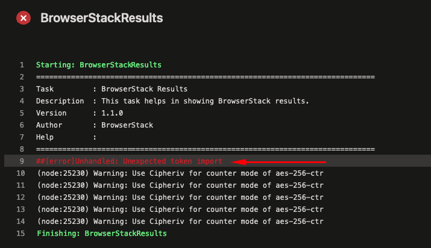
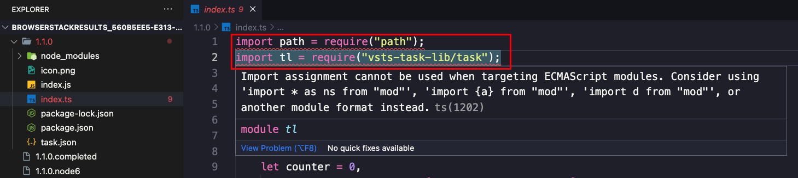
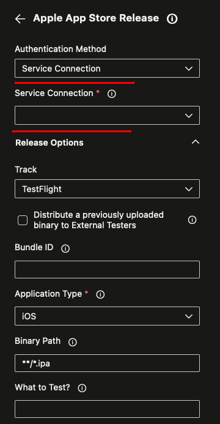

# Original Repo

This project was born in the AzureDevOps repository and was brought to gitHub.
Link repo AzureDevOps: https://dev.azure.com/vitorcscontato/_git/bees_ios_app

# BEES ipa file.

https://drive.google.com/file/d/1rsOP3dyTQ0sIyAnW1Nf_Jup9GeOMzUcU/view?usp=sharing

# BEES Mobile DevOps Code Challenge
## Goal
The BEES Mobile team needs your help to deploy an IOS app to our testing environment. In order to ensure the quality of the code, we will need you to create a simple Azure DevOps Pipeline that can run the following tasks:

1. Run Sonar Cloud and break the deployment if it doesn’t pass the quality gate. -> OK
2. Run BrowserStack tests during the build. -> OK
3. Mac Stadium IOS agent integration -> (View in Not Done)
4. Deploy an executable IOS app to a development environment. -> (View in Not Done)

## Errors Found

1. BrowserStackResults

During the execution of tests, specific in `stage Test` in the `job IntegrationTestBrowserStack` I had a problem "Unexpected token import" according to the image below.

To solve this problem, I try to install the package `esm` of node because I believed that would enable support for ES6 in my code, but no success.
As I was using my machine as agent pools, I did a troubleshooting in files that BrowserStackResults downloaded and found that error suspicious in code as showed by the image below, and looks like this is not correct according to documentation.

Doc source 1: https://nodejs.org/api/esm.html#enabling

Doc source 2: https://stackoverflow.com/questions/39436322/node-js-syntaxerror-unexpected-token-import

## Not Done

1. Mac Stadium IOS agent integration

    I created my account in MacStadium, but any services need to contact sales. 

2. Deploy an executable IOS app to a development environment.

    To deploy I try to use TestFlight but needs account in Apple App Store.

